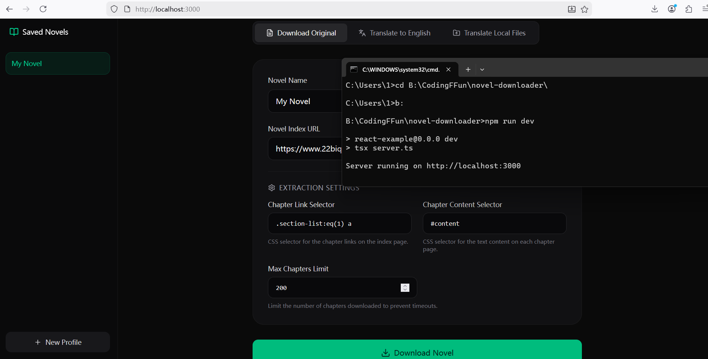

<div align="center">

</div>

# Run and deploy your AI Studio app

This contains everything you need to run your app locally.

Create this app by AI Studio without codeing any lines! But alter the translation function use Tencent API(Free for 5,000,000 characters) instead of Gemini it used as default.( Because of tokens!!)

## Run Locally

**Prerequisites:**  Node.js

1. Install dependencies:
   `npm install`
2. Set the `TENCENT KEY` in [.env](.env.local) to your TENCENT Account`
   
   ```
   TENCENT_SECRET_ID=******
   TENCENT_SECRET_KEY=*******
   TENCENT_REGION=********
   ```
3. Run the app:
   `npm run dev`
   
   # novel-downloader
   
   
